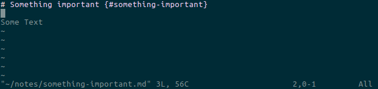
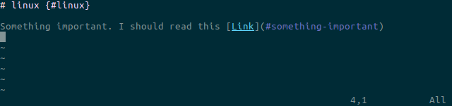
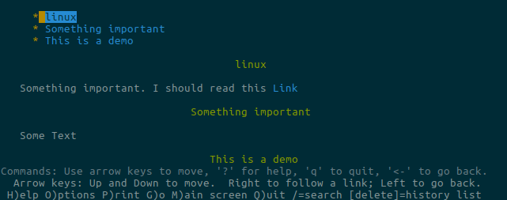

# note.sh

A bash script with simple functions for note taking. Notes are stored as 
separate future-proof markdown text files. The use of markdown together with 
pandoc allows it to interlink the different notes. Lynx is used for viewing and 
navigating the transformed markdown files. Grep is used for searching through 
the taken notes.

## Dependencies

It depends on git, pandoc, lynx, and a text editor of your choice 
(default: vim). Git is used for synchronizing the notes. 
Pandoc creates a html with a table of content from the markdown files and 
subsequently lynx is used for viewing and navigating notes in a nice way.

## Example

```bash
# Init directory with or without remote repo
~ $ note init
Initialized empty Git repository in /home/youruser/notes/.git/
no remote set
# Add notes 
~ $ note add "This is a demo"
# Pull, add, commit, push notes
~ $ note sync
[master (root-commit) e4b03f8] note-sync
 1 file changed, 3 insertions(+)
 create mode 100644 this-is-a-demo.md
~ $ note add "Something important"
~ $ note add linux
# Edit existing notes
~ $ note linux
# View and navigate notes with lynx
~ $ note view all
~ $ note view linux "This is a demo"
# Ls notes
~ $ note
linux.md  something-important.md  this-is-a-demo.md
# Search
~ $ note search linux
/home/youruser/notes/linux.md:1:# linux {#linux}
# Purge notes
~ $ note purge "This is a demo"
~ $ note
linux.md  something-important.md
~ $ note sync
[master 9c9a326] note-sync
 3 files changed, 6 insertions(+), 3 deletions(-)
 create mode 100644 linux.md
 create mode 100644 something-important.md
 delete mode 100644 this-is-a-demo.md
```

Markdown note inside vim:



Markdown note with pandoc reference inside vim:



Markdown files converted by pandoc to html and viewed inside lynx:



## Usage

NOTE\_DIR and NOTE\_EDITOR are set inside the bash script. Simply source note.sh
inside your ~/.bashrc.

Command | Explanation
------------ | -------------
note | Lists all taken notes.
note init [remote] | Initializes NOTE_DIR and a git repo. The remote is optional.
note add \<name\> | Adds a new note or opens an existing one.
note \<name\> | Opens an existing note with the NOTE_EDITOR (default: vim).
note purge \<names\> | Purges notes.
note view \<names\> | Executes pandoc with the specified note names. Pandoc generates html that is viewed with lynx.
note view all | Executes pandoc with all notes. Pandoc generates html that is viewed with lynx.
note search \<regex\> | Searches all md files within NOTE_DIR with grep -n -i -r.
note sync [commitmsg] | Executes git pull, add, commit, and push. Omits pull and push if there is no remote given. Commit message is optional.
note \<help\|-h\> | Shows all commands.


